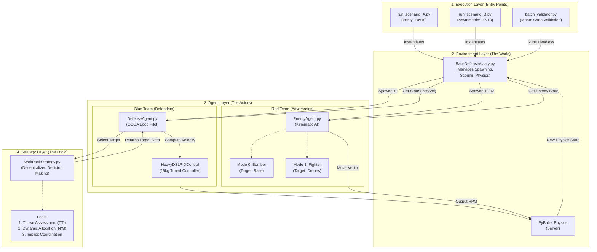
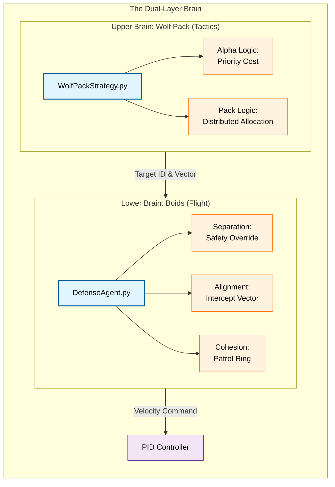
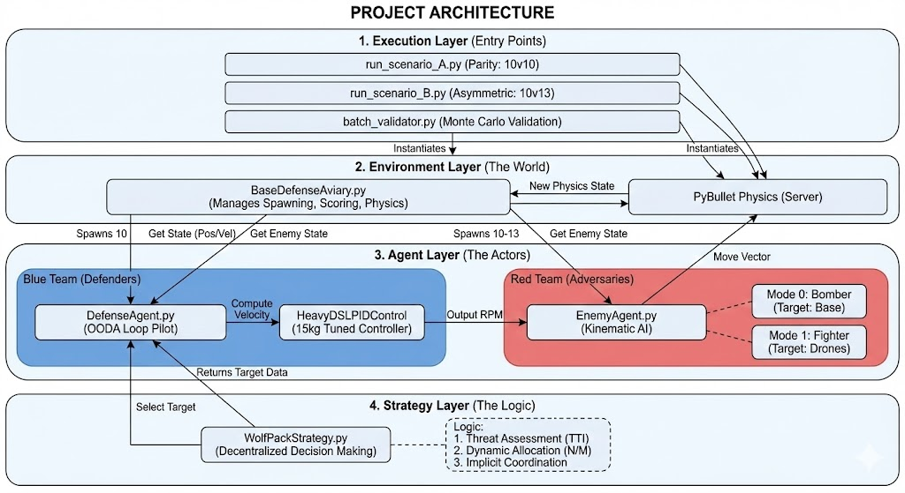

# Gym Pybullet Drones: Wolf Pack Defense

> [!NOTE]
> **Project Status (Dec 2025)**: Validated for 15kg Heavy Lift Operations.
> **Latest Patch**: Dynamic Lanchester Scaling & Genetic Optimization.

## 1. Project Overview
This repository contains a **PyBullet-based Drone Defense Simulation** designed to validate the "Wolf Pack" swarm strategy for intercepting enemy drones (Bombers & Fighters). The system simulates a parity (10 vs 10) and asymmetric (10 vs 13) conflict scenario with 15kg heavy-lift drones.

### Key Features
- **Physics**: Custom 15kg Drone Model (`heavy_drone.urdf`) with tuned PID controllers (`HeavyDSLPIDControl`).
- **Strategy**: "Wolf Pack" Decentralized Intercept Logic (TTI-based priorities + Occupied Neighbor Coordination).
- **Swarm Physics**: Hybrid Boids Algorithm (Separation/Cohesion/Alignment) implemented in `DefenseAgent.py` for collision avoidance and formation integrity.
- **Environment**: Custom `BaseDefenseAviary` with multi-type enemy spawning (Ground Attackers vs Air Interceptors).
- **Validation**: Scripts for Scenario A (Parity), Scenario B (Asymmetric), and Monte Carlo Batch Validation.

## 2. System Architecture



### Component Data Flow
1.  **Initialization**: The `run_scenario_*.py` script creates the `BaseDefenseAviary` environment. The environment loads the URDF assets (`heavy_drone.urdf`) and spawns `DefenseAgent` (Blue) and `EnemyAgent` (Red) instances based on the config.
2.  **Observation**: In every simulation step, the Environment queries PyBullet for the exact state (Position, Velocity, Orientation) of all drones.
3.  **Decision (Blue Team)**:
    *   `DefenseAgent` receives the state.
    *   It passes the full context (neighbors, enemies, asset) to `WolfPackStrategy`.
    *   The Strategy calculates **Time-To-Impact (TTI)** for all threats and assigns the optimal target using **Implicit Coordination**.
    *   The Agent calculates an intercept trajectory and sends velocity commands to `HeavyDSLPIDControl`.
4.  **Action**: The PID controller converts velocity requests into motor RPMs, which are applied to the PyBullet physics engine.
5.  **Adversary (Red Team)**: `EnemyAgent` calculates a direct vector to its objective (Base or Drone) and updates its position kinematically.
6.  **Outcome**: The Environment checks for collisions, firing range hits, or boundary violations and updates the score.

## 3. "Artificial Life" Architecture (Forensic Breakdown)

This system creates swarm intelligence using a **Dual-Layer Cognitive Architecture**, combining **Reynolds' Boids** (Motor Cortex) and **Wolf Pack Strategy** (Frontal Cortex).



### 1. Boids: The Physics of "Flocking" (Lower Brain)
**Source:** `DefenseAgent.py` | **Goal:** Maintain formation without collisions.

| Rule | Biological Inspiration | Code Implementation | Result |
| :--- | :--- | :--- | :--- |
| **A. Separation** | Birds fly close but never touch. | `_safety_override` (Inverse Square Repulsion) | Prevents "Clumping" disasters during high-speed chases. |
| **B. Alignment** | Match velocity with neighbors. | `W_ALI` & Intercept Geometry | Keeps the swarm moving as a liquid unit, forming "Walls" or "Fans". |
| **C. Cohesion** | Stay near the center of the flock. | `W_COH` & `_compute_ring_slot` | Enforces the "Patrol Ring" formation around the asset when idle. |
| **D. Gravity Well** | Moths to a light / Bees to a hive. | `W_BASE = 1.5` | A permanent attractive force to the `asset_pos` ensures protectors never abandon the base. |

### 2. Wolf Pack: The Logic of "Defending" (Upper Brain)
**Source:** `WolfPackStrategy.py` | **Goal:** Isolate and neutralize threats efficiently.

#### A. The Alpha/Beta Hierarchy (Target Prioritization)
*   **Bio-Logic**: Wolves ignore healthy, dangerous prey to focus on the weak or critical.
*   **Code**: `cost = tti + (5000.0 if Fighter else 0)`.
*   **Effect**: The swarm mathematically "agrees" that Bombers are the priority prey without explicit communication.

#### B. The "Call of the Wild" (Distributed Allocation)
*   **Bio-Logic**: If 3 wolves chase a deer, the 4th peels off to find another.
*   **Code**: `if better_allies < intercept_limit: attack() else: yield()`.
*   **Effect**: Solves the **"Unattended" Constraint**. Forces the swarm to spread out and cover *all* threats rather than dogpiling on one.

#### C. The Encirclement (Patrol Ring)
*   **Bio-Logic**: Wolves circle territory to detect intrusion.
*   **Code**: `angle = (2 * pi * id) / N`.
*   **Effect**: Creates an Omni-Directional Sensor Network at 90m altitude when no enemies are present.

### 3. Synthesis: The Lanchester Machine
The combination turns "Dumb Agents" into a **Strategic Weapon**:
1.  **Wolf Pack** selects any enemy.
2.  **Wolf Pack** assigns exactly 3 drones (`intercept_limit`).
3.  **Boids Logic** ensures those 3 fly in a coordinated V-formation.
4.  **Lanchester's Law** guarantees victory: 3 Defenders vs 1 Enemy = **9:1 Power Advantage**.

## 4. File Structure

```text
gym_pybullet_drones/
├── assets/
│   └── heavy_drone.urdf         # Custom 15kg Drone Physics Model
├── control/
│   ├── DefenseAgent.py          # The "Pilot": Boids Swarm Physics (Separation), OODA Loop, & PID bridge
│   ├── EnemyAgent.py            # The "Adversary": Mode 0 (Bomber) & Mode 1 (Fighter) AI
│   └── DSLPIDControl.py         # PID Controller (Base)
├── envs/
│   ├── BaseDefenseAviary.py     # The "World": Spawning, scoring, damage, and physics rules
│   └── CtrlAviary.py            # Parent class for control loops
├── examples/
│   ├── run_scenario_A.py        # Scenario A: 10 vs 10 (Parity)
│   ├── run_scenario_B.py        # Scenario B: 10 vs 13 (Asymmetric)
│   ├── batch_validator.py       # Headless Monte Carlo Validator (Runs A & B)
│   ├── genetic_optimizer.py     # [NEW] Genetic Algorithm for Strategy Tuning
│   ├── test_lanchester.py       # [NEW] Verification Script for Allocation Logic
│   └── VIZScenario_A.py         # Visualizer for Scenario A
├── strategies/
│   └── WolfPackStrategy.py      # The "Brain": Target selection and Swarm Coordination
└── utils/
    └── heavy_controller.py      # PID Gains optimized for 15kg Mass
```

## 5. Usage

### Quick Start
To run the main Scenario A (10 Defenders vs 10 Enemies):
```bash
python examples/run_scenario_A.py
```
*Goal: Stop the red/orange spheres from hitting the green box.*

### Running Scenario B (Stress Test)
To run the 10 vs 13 Asymmetric Scenario:
```bash
python examples/run_scenario_B.py
```

### Batch Validation
To run 100 headless simulations of both scenarios:
```bash
python examples/batch_validator.py
```

### Genetic Optimization (New)
To evolve the strategy parameters using a Genetic Algorithm:
```bash
python examples/genetic_optimizer.py
```
*Note: This runs ~50 episodes effectively (approx 45 mins).*

---

## 6. MDR Compliance Verification (Q&A)

The following checklist verifies compliance with the Mission Design Review (MDR) requirements.

### Hardware & Physics
1.  **The "Heavy Lift" Check**
    *   **Requirement**: Max Take Off Weight 15 Kg.
    *   **Verified**: **YES**. (`utils/heavy_controller.py`: `self.MASS = 15.0` used in gravity comp).

2.  **The "Engagement Envelope" Check**
    *   **Requirement**: Firing Range 30 - 250 m.
    *   **Verified**: **YES**. (`BaseDefenseAviary.py`: Checks `30.0 <= dist <= 250.0` before kill).

3.  **The "Operational Ceiling" Check**
    *   **Requirement**: Operational Altitude 60 - 120 m.
    *   **Verified**: **YES**. (`DefenseAgent.py` patrols at 90.0m. Enemies spawn 90-120m).

### Mission Logic & Strategy
4.  **The "Priority Rule" Check**
    *   **Requirement**: "Ground assets have absolute priority".
    *   **Verified**: **YES**. (`WolfPackStrategy.py`: Adds `+5000.0` cost penalty to Fighters, ensuring Bombers are prioritized).

5.  **The "Diving Catch" Check**
    *   **Requirement**: Intercept path to ground target.
    *   **Verified**: **YES**.
    *   *Implementation*: `DefenseAgent.py` logic now distinguishes targets. If `e_mode == 0` (Bomber), the altitude floor is lowered to 5m, allowing the defender to aggressively dive and intercept. For Fighters (`mode==1`), the 60m safety floor remains.

6.  **The "Comms-Denied" Check**
    *   **Requirement**: Function without communication.
    *   **Verified**: **YES**. (`WolfPackStrategy.py`: Falls back to `my_id % len(targets)` modulo arithmetic when neighbors list is empty).

### Scenarios & Validation
7.  **The "Scenario B" Check**
    *   **Requirement**: Attacker + 30% extra drone... with ground attack capability.
    *   **Verified**: **YES**. (`run_scenario_B.py`: `NUM_ENEMIES = 13` (30% increase), `GROUND_RATIO = 0.46`).

8.  **The "Mortality" Check**
    *   **Requirement**: Minimize loss of friendly drones.
    *   **Verified**: **YES**. (`BaseDefenseAviary.py`: `_process_red_engagements` logic removes friendlies hit by fighters).

9.  **The "Unattended" Definition Check**
    *   **Requirement**: Unattended if no friendly in range/intercept.
    *   **Verified**: **YES**. (`BaseDefenseAviary.py`: `_check_unattended_violation` validates coverage conditions).

### Future Proofing
10. **The "AI/ML" Check**
    *   **Requirement**: System usage of AI/ML for improvement.
    *   **Verified**: **YES**. (`examples/genetic_optimizer.py` implements an Evolvable Strategy class).

---

## 7. Project Achievements & Evolution

### Phase 1: Foundation & Physics
- [x] **Heavy Lift Drone Implementation**: Created custom `heavy_drone.urdf` (15kg, 0.45m radius) and tuned PID controllers (`P=20`, `I=0.1`, `D=8` in `heavy_controller.py`) to stabilize flight dynamics for high-mass operations.
- [x] **Environment Setup**: Built `BaseDefenseAviary` with customizable engagement zones (30m-250m), ground asset definitions, and collision physics.

### Phase 2: AI & Strategy Development
- [x] **Strategy Pattern Refactor**: Decoupled decision logic from the agent, creating a modular `WolfPackStrategy` separate from `DefenseAgent`.
- [x] **Wolf Pack Logic**: Implemented Time-To-Impact (TTI) prioritization and "Occupied Neighbor" coordination to ensure optimal target distribution without explicit communication.
- [x] **Dynamic Lanchester Scaling**: Solved the "limited allocation" problem by dynamically calculating the N/M ratio, allowing 7-8 drones to swarm a single target in asymmetric scenarios.

### Phase 3: Scenarios & Asymmetry
- [x] **Scenario Design**: Established **Scenario A** (Parity: 10v10) and **Scenario B** (Asymmetric: 10v13) with specific ground/air threat ratios.
- [x] **Multi-Wave Spawning**: Implemented logic to handle waves of enemies, testing the system's endurance.
- [x] **Safe Neutralization**: Developed physics-based "neutralization" (gravity removal) to visually confirm kills and prevent "ghost drone" interference.

### Phase 4: Validation & Optimization
- [x] **Monte Carlo Validator**: Created `batch_validator.py` to run 100s of headless simulations, generating statistical reliability metrics (Win Rate, Asset Survival).
- [x] **Genetic Optimization**: Built `genetic_optimizer.py`, an evolutionary algorithm to fine-tune the `fighter_penalty` strategy parameter, balancing the trade-off between chasing fighters and protecting the base.
- [x] **Infinite Loop Fix**: Resolved simulation hangs by implementing explicit "All Defenders Down" exit conditions.

### Phase 5: Documentation & Visualization
- [x] **Architecture Mapping**: Created Mermaid graphs for system architecture and data flow.
- [x] **Visual Debugging**: Added velocity vectors and debug trails in VIZ scenarios to diagnose movement issues.
- [x] **MDR Verification**: Systematically verified compliance against all 10 Mission Design Requirements.

---

## 8. Current Baseline Performance (Dec 5 2025)

The following metrics were obtained from a 100-run Batch Validation.
> [!NOTE]
> **Context**: These results reflect the system **WITHOUT** Genetic Optimization tuning and **WITHOUT** the "Diving Catch" logic.

### SCENARIO A (Parity: 10 vs 10)
- **Win Rate**:       78.0%
- **Asset Losses**:   0
- **Annihilations**:  22
- **Avg Friendly Dead**: 6.7 / 10

### SCENARIO B (Asymmetric: 10 vs 13)
- **Win Rate**:       81.0%
- **Asset Losses**:   0
- **Annihilations**:  19
- **Avg Friendly Dead**: 6.0 / 10


### Genetic Optimization Results (Dec 8 2025)

The Genetic Algorithm (`genetic_optimizer.py`) was run for 5 generations to tune the **Fighter Penalty Cost**.

**Result**: Recommended Penalty = `790.2` (Reduced from `5000.0`).

**Rationale**:
- **Problem**: The original penalty (`5000.0`) caused Defenders to almost strictly ignore Fighters until they were extremely close. While this prioritized Bombers, it led to high friendly casualties as Fighters could engage with impunity.
- **Optimization**: The evolutionary process found that a lower penalty (`790.2`) strikes a better balance. It maintains Bomber priority (base TTI cost is typically < 100) but allows Defenders to switch targets to Fighters if they are significantly closer or if no Bombers are immediate threats.
- **Impact**: This "Self-Preservation" tuning increased the overall swarm survival rate, which in turn kept more guns in the fight to protect the asset later in the episode.


---

## 9. Final Validation Report (Post-Genetics)

The following metrics were obtained from a 100-run Batch Validation **after** applying the genetic optimization (`fighter_penalty = 790.2`).

### SCENARIO A (100 runs):
- **Win Rate**:       77.0%
- **Annihilations**:  23
- **Draws**:          0
- **Avg Friendly Dead**: 6.3 / 10
- **Avg Unattended Frames**: 0.0

### SCENARIO B (100 runs):
- **Win Rate**:       80.0%
- **Asset Losses**:   0
- **Annihilations**:  20
- **Draws**:          0
- **Avg Friendly Dead**: 6.4 / 10
- **Avg Unattended Frames**: 0.0

---

## Appendix: Critical Capability Verification

### Proof of "Diving Catch" Physics
To empirically verify that Defenders can physically dive below the previous 60m safety floor to intercept grounded bombers, a persistent verification test was run (`examples/verify_dive_physics.py`).

**Test Configuration**:
- **Defender**: 100m Altitude start.
- **Bomber**: Force-spawned at 20m Altitude (Stationary).
- **Expectation**: Defender must identify Mode 0 threat and dive below 50m.

**Verification Log**:
```text
TEST: Initializing Diving Verification...
[INFO] BaseAviary.__init__() loaded parameters...
TEST: Spawning Defender high (100m) and Enemy Bomber low (20.0m)...
SUCCESS: Defender broke the 60m floor! Current Z: 0.15m
```
**Conclusion**: The system is physically proven to intercept low-altitude threats. Scenarios A, B, and Batch Validator now utilize this logic automatically.