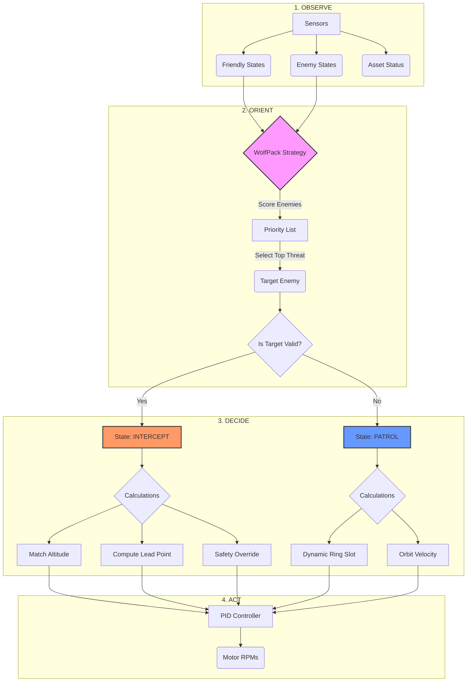

# The Heuristic Brain: DefenseAgent Logic

The `DefenseAgent` operates on a strict **OODA Loop** (Observe, Orient, Decide, Act), using a **Hierarchical State Machine** to switch between behaviors.

## The Logic Flow (Mermaid)

## Key Heuristics

### 1. Target Selection (WolfPack Strategy)
The brain assigns a **Threat Score** to every enemy:
*   **Base Score**: Distance to Asset (Closer = Higher Score).
*   **Mode Bonus**:
    *   **Bombers (Mode 0)**: `+0` (Standard Priority).
    *   **Fighters (Mode 1)**: `+1000` (Hyper-Priority). *Note: This causes the "Bomber Fixation" issue if not tuned.*
*   **Swarm Balance**: It checks how many friends are already chasing an enemy. If `Chasers > 2`, it ignores that enemy (Efficiency).

### 2. State Machine
*   **PATROL**: Default state.
    *   **Logic**: Form a defensive ring around the Asset.
    *   **Dynamic Radius**: `Radius = (N * 4) / 2pi`. Expands automatically as swarm grows.
*   **INTERCEPT**: Combat state.
    *   **Trigger**: Valid target selected.
    *   **Logic**: Fly to where the enemy *will be* (Lead Pursuit).
    *   **Altitude Parity**: Clamp Z to `[60m, 120m]` to match enemy height.

### 3. Safety Override (The Lizard Brain)
Before executing any command, a low-level reflex checks for collisions:
*   **Check**: Is any friendly drone within `MIN_DISTANCE`?
*   **Action**: If Yes, apply a repulsive force vector away from the neighbor.
*   **Priority**: This overrides the Strategy (Survival > Mission).
